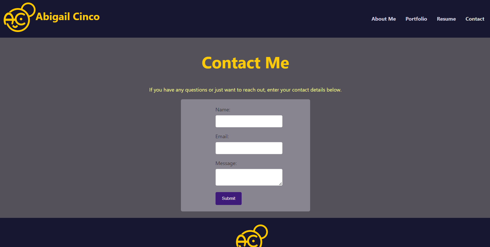
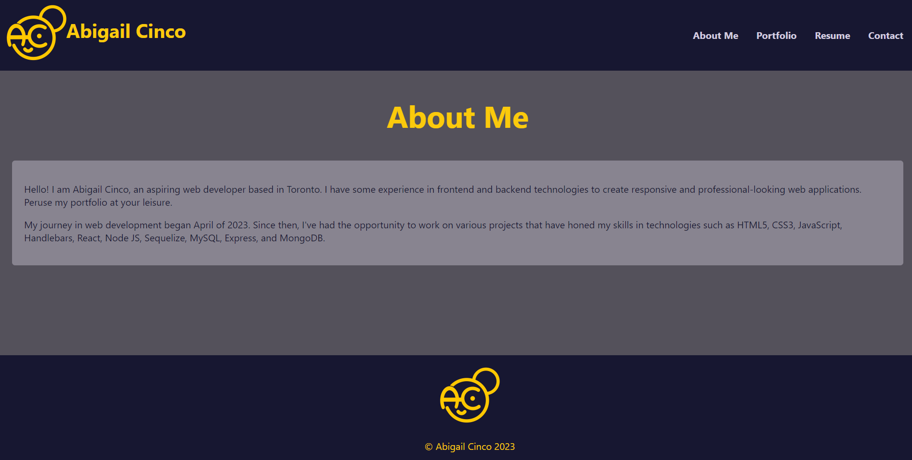
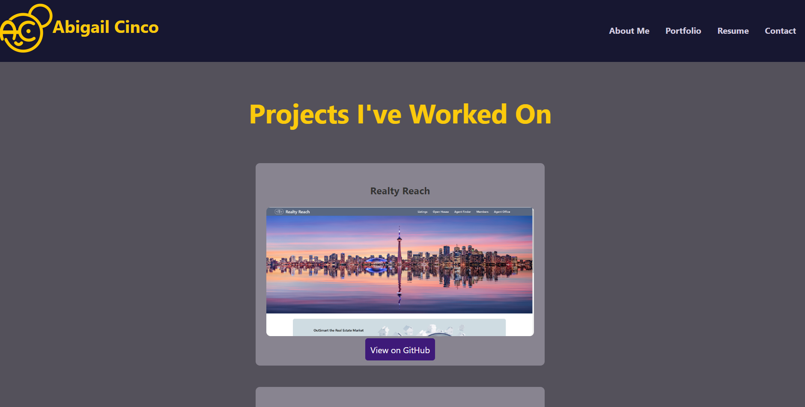
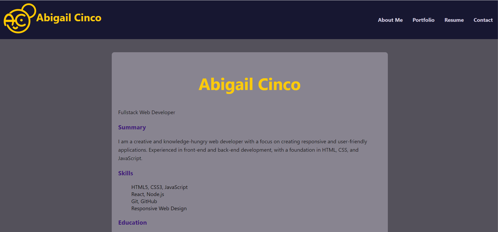

  # Professional React Portfolio

  ## Description

  This is a portfolio I made using React and CSS to display and show off what I've learned so far.

  ## Table of Contents
   - [Description](#description)
   - [Installation](#installation)
   - [Usage](#usage)
   - [License](#license)
   - [Contributions](#contributions)
   - [License](#license)
   - [Contact Me](#contact-me)

  ## Installation

  Clone this repository to your local machine, install the dependencies with "npm install", and then enter "npm run start" in your terminal.

  ## Usage

  After running this from your terminal, navigate through the pages with the nav bar and view each page. If you wish to contact me, enter your details via the contact page.

  View a demo of it [HERE](https://drive.google.com/file/d/1GUfRUWLZIZW2fNGjyZZUCoQT9P20Xc6k/view)

  
  
  
  

  ## Credits

  I made this with React and CSS

  ## Contributions

  N/A

  ## License

   Licensed by the MIT License: https://opensource.org/licenses/MIT

  ## Contact Me
  Have any Questions? Contact me at:

  [My GitHub](https://github.com/abi-gail17)

  or email me at cinco.de.abby@gmail.com

